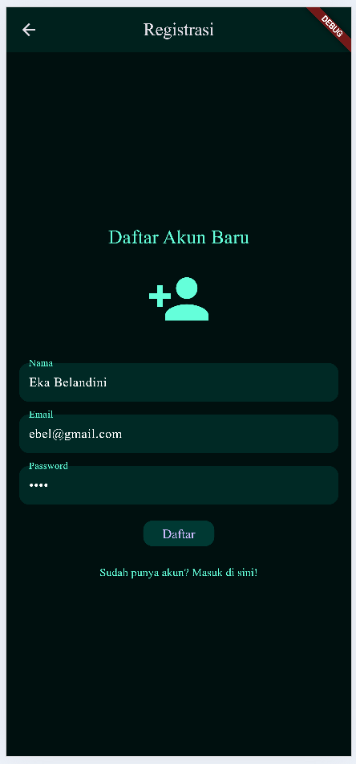
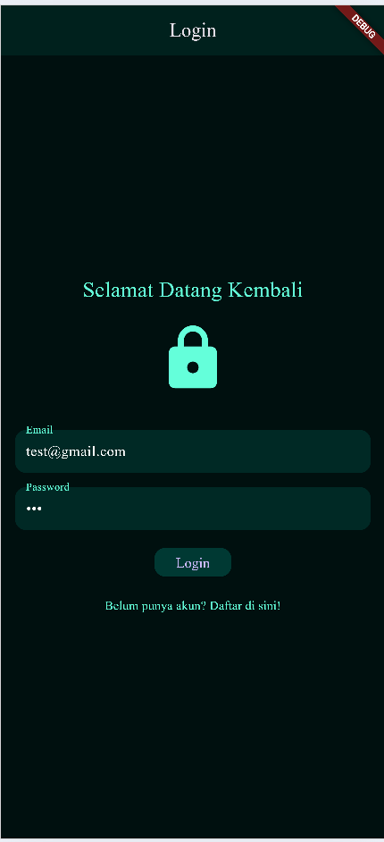
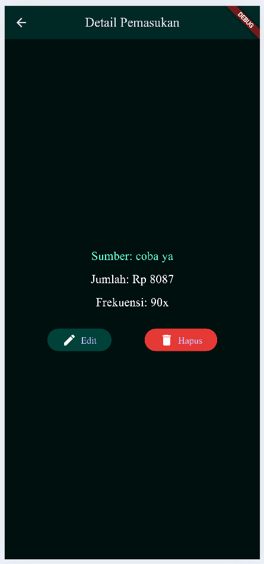
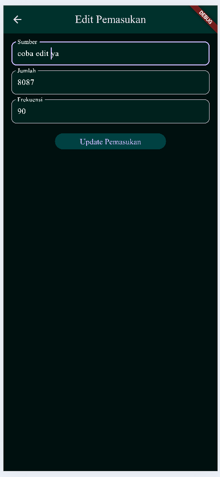
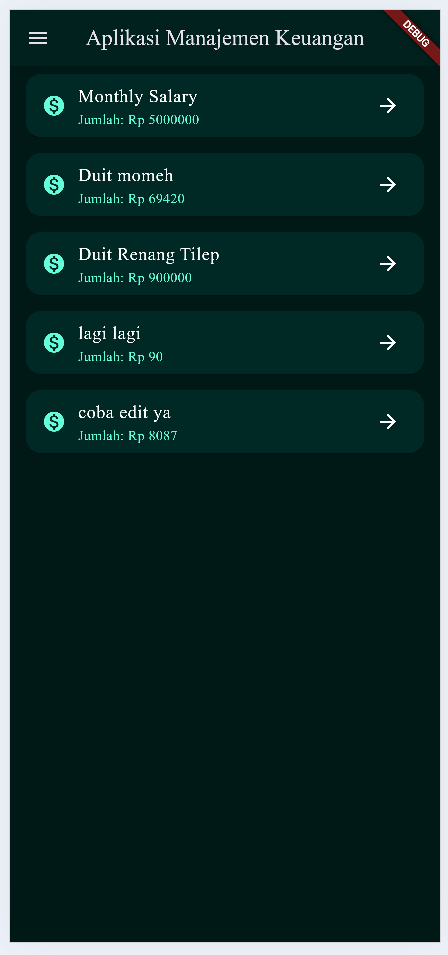
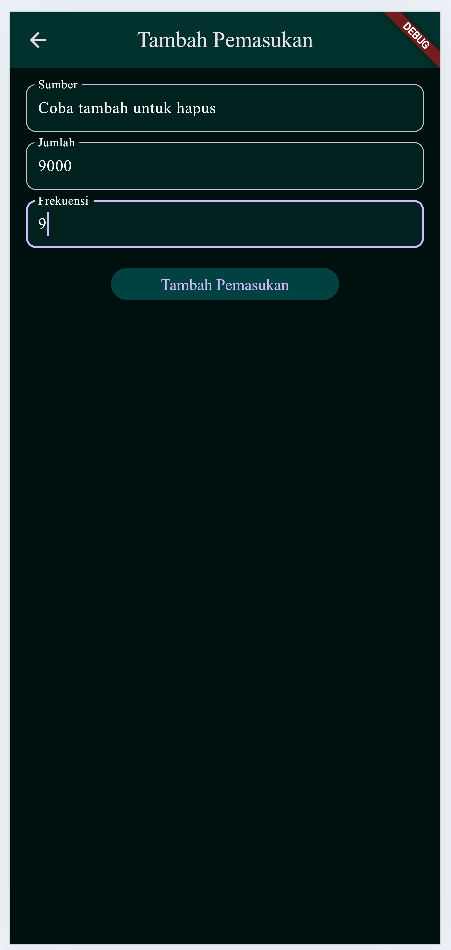
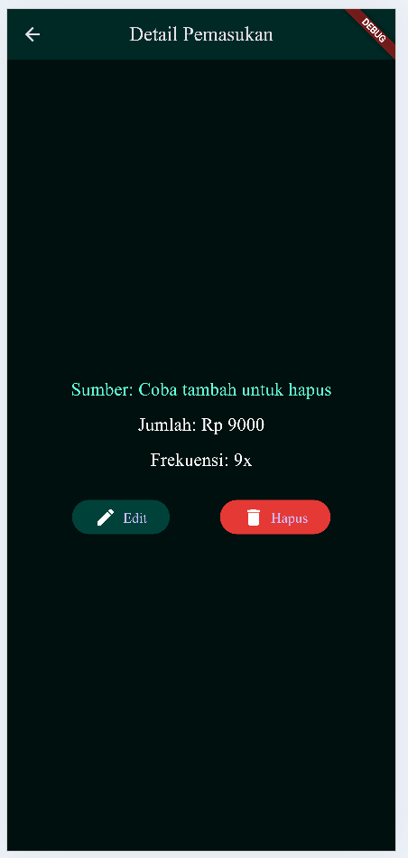
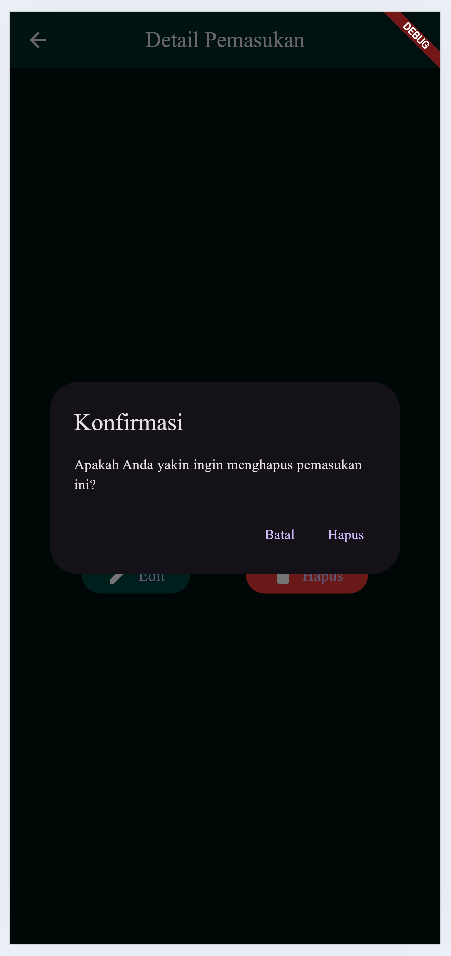

# Aplikasi Pengelolaan Keuangan

**Nama**  : Eka Belandini  
**NIM**   : H1D022002  
**Shift** : F

## Deskripsi Proyek

Proyek ini adalah aplikasi pengelolaan keuangan sederhana yang dibangun menggunakan Flutter. Aplikasi ini memiliki fitur CRUD (Create, Read, Update, Delete) untuk pemasukan, dengan desain bernuansa hijau gelap dan font "Times New Roman". Aplikasi ini juga menyimpan preferensi pengguna seperti token autentikasi dan informasi profil menggunakan `SharedPreferences`.

## Penjelasan File dan Struktur Kode

### Penjelasan File

- **main.dart**: Berisi kode utama aplikasi dan pengaturan routing.
- **lib/pages/home_page.dart**: Halaman utama setelah login, menampilkan daftar pemasukan pengguna.
- **lib/pages/login_page.dart**: Halaman login untuk proses autentikasi pengguna.
- **lib/pages/detail_pemasukan.dart**: Menampilkan detail pemasukan, serta menyediakan opsi untuk mengedit atau menghapus data pemasukan.
- **lib/pages/add_pemasukan.dart**: Halaman untuk menambahkan pemasukan baru.
- **lib/models/pemasukan_model.dart**: Model data pemasukan.
- **lib/services/api_service.dart**: Berisi fungsi untuk menghubungkan aplikasi dengan API, seperti login dan pengelolaan data pemasukan.

### Penjelasan Struktur Kode

#### 1. **main.dart**
   - **`runApp(MyApp())`**: Memulai aplikasi dengan widget `MyApp`.
   - **`MaterialApp`**: Menyediakan tema dan navigasi untuk aplikasi.
     - **`routes`**: Mendefinisikan rute untuk halaman `Login`, `Home`, dan lainnya.
     - **`initialRoute`**: Menentukan halaman yang ditampilkan saat aplikasi dibuka (biasanya login).

#### 2. **lib/pages/login_page.dart**
   - **`TextField`**: Untuk input email dan password.
   - **`ElevatedButton`**: Tombol login untuk memulai proses autentikasi menggunakan API.
   - **`SharedPreferences`**: Menyimpan informasi login untuk digunakan kembali di halaman profil dan lainnya.

#### 3. **lib/pages/home_page.dart**
   - **`FutureBuilder`**: Menampilkan daftar pemasukan yang diambil dari API.
   - **`ListTile`**: Digunakan untuk menampilkan setiap pemasukan dengan tombol detail untuk melihat informasi lebih lanjut.

#### 4. **lib/pages/detail_pemasukan.dart**
   - Menampilkan detail pemasukan, dengan opsi untuk mengedit atau menghapus data.
   - **`ElevatedButton`**: Tombol untuk mengedit dan menghapus pemasukan, dengan konfirmasi penghapusan menggunakan dialog.

## Demo Aplikasi

Berikut adalah beberapa screenshot dari aplikasi:
### Screenshot Halaman Registrasi


### Screenshot Halaman Login


### Screenshot Halaman Utama


### Screenshot Halaman Sidebar


### Screenshot Halaman Detail Pemasukan


### Screenshot Halaman Edit Pemasukan


### Screenshot Halaman Edit Pemasukan Berhasil


### Screenshot Halaman Tambah Pemasukan


### Screenshot Halaman Tambah Pemasukan Berhasil


### Screenshot Halaman Detail sebelumHapus Pemasukan


### Screenshot Halaman Konfirmasi Hapus Pemasukan


### Screenshot Halaman Hapus Pemasukan Berhasil


## Cara Menjalankan Aplikasi

1. **Instalasi Flutter**: Pastikan Anda sudah menginstal Flutter. Ikuti panduan instalasi di [dokumentasi Flutter](https://flutter.dev/docs/get-started/install).
2. **Clone Repository**: Clone repository proyek ini dengan perintah berikut:
   ```bash
   git clone <URL_REPOSITORY>
